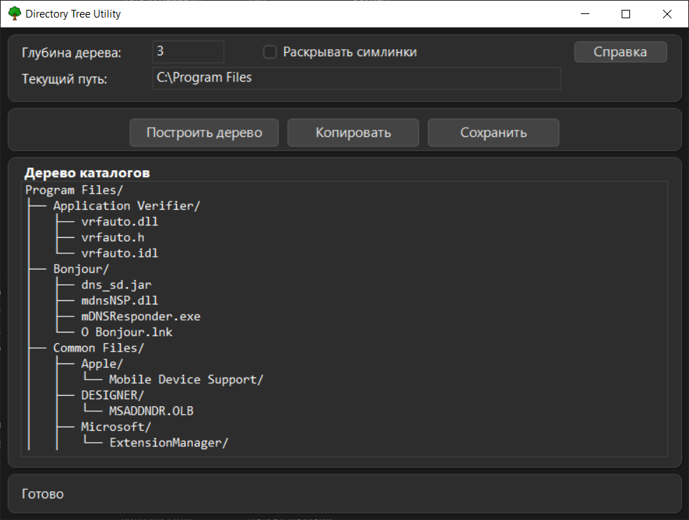

# Directory Tree Utility

Нативная Windows-утилита для генерации символьного дерева папок с быстрым экспортом в буфер обмена и в файл.

## Скриншот



## Возможности

- Автоматически определяет активный путь из File Explorer
- Генерирует дерево директорий асинхронно (UI не блокируется)
- Поддерживает настройку глубины
- Копирование и сохранение результата (`.txt`, `.json`, `.xml`)
- Кастомный UI в темной теме
- Контекстные меню в едином стиле (включая дочерние окна)
- Глобальный хоткей `Alt+T`
- Работа через системный трей
- Проверка обновлений и обновление приложения из релизов GitHub

## Быстрый старт

### Требования

- Windows 10/11
- CMake 3.16+
- C++17-совместимый компилятор
- Visual Studio 2022 (MSVC) + Windows SDK

### Сборка

```powershell
git clone https://github.com/Laynholt/DirectoryTreeUtility.git
cd DirectoryTreeUtility
cmake -S . -B build
cmake --build build --config Release
```

Готовый exe:

`build/bin/Release/DirectoryTreeUtility.exe`

## Использование

- Нажмите `Построить дерево`, чтобы сформировать структуру для текущей папки.
- Используйте `Копировать` или `Сохранить`.
- В разделе `Справка` доступны:
  - `Горячие клавиши`
  - `О программе`
- В окне `О программе` есть кнопка `Проверить обновления`.

## Горячие клавиши

- Глобально: `Alt+T` — показать/скрыть окно.
- Внутри приложения:
  - `Enter` — построить дерево
  - `Ctrl+C` — копировать результат
  - `Ctrl+S` — сохранить результат
  - `0-9`, `-`, `Backspace`, `Shift+Backspace` — работа с полем глубины

## Лицензия

MIT, см. файл `LICENSE`.
